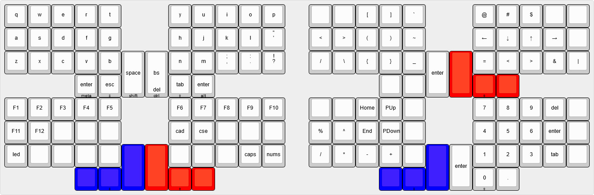

## crkbd
aka corne aka helidox

### keymap

#### features
- full numpad
- qwerty
- single hand navigation for page up/down and arrows
- easy access to programming keys
- focus on thumb modifiers to limit pinky usage and outter edge modifiers
- re-arranged ,/; ./: ?/! to be shifted access
- hold/tap on thumbs
  - meta/enter
  - lower/escape
  - shift/space
  - control/backspace(delete?)
  - raise/tab
  - alt/enter

## references
- hold/tap inspired by [norman's minidox keymap](https://github.com/qmk/qmk_firmware/tree/master/keyboards/minidox/keymaps/norman)
- [keyboard layout editor](http://www.keyboard-layout-editor.com/#/)
- [qmk docs](https://docs.qmk.fm/)
