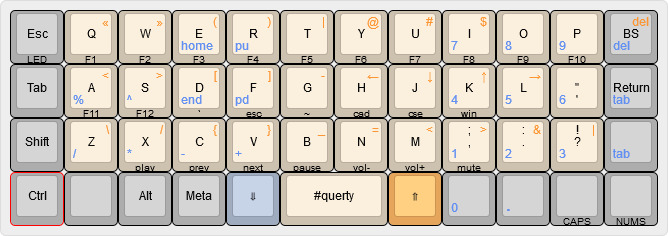

## planck
rev5 version created and sold by OLKB

### keymap

#### features
- full numpad
- qwerty
- single hand navigation for page up/down and arrows
- easy access to programming keys
- re-arranged ,/; ./: ?/! to be shifted access

## references
- [keyboard layout editor](http://www.keyboard-layout-editor.com/#/)
- [qmk docs](https://docs.qmk.fm/)
- [Default Keymap](https://github.com/qmk/qmk_firmware/tree/master/keyboards/planck/keymaps/default)
